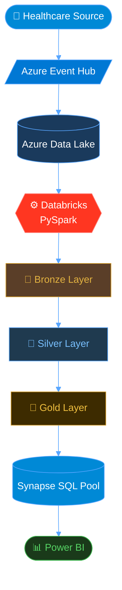
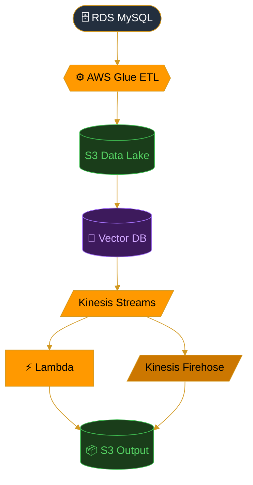

<div align="center">


<br/>

<a href="https://git.io/typing-svg">
  
</a>

<br/><br/>

[](https://www.linkedin.com/in/shehab-ahmed-793780343)
[](https://www.youtube.com/@shehaba7med)
[](https://shehab-hub-0.github.io/Shehab.github1.io/)
[](mailto:shahbahmed56p@gmail.com)
[](https://github.com/shehab-hub-0)

<br/>


&nbsp;


</div>

---


##  &nbsp; About Me

```python
class DataEngineer:

    def __init__(self):
        self.name         = "Shehab Eldin Ahmed"
        self.role         = "Data Engineer & Pipeline Architect"
        self.education    = "Electronics & Automatic Control Engineering"
        self.location     = "Egypt 🇪🇬"
        self.current_goal = "Healthcare real-time pipeline | Microsoft Fabric | Databricks"

    def what_i_build(self) -> list:
        return [
            "⚡ Real-time streaming pipelines (Kafka + Spark Streaming)",
            "🥇 Medallion Architecture ELT systems (Bronze → Silver → Gold)",
            "☁️ Cloud data warehouses on GCP, Azure & AWS",
            "🔁 Automated ETL workflows with Airflow & Docker",
            "📊 Analytics dashboards powered by Power BI"
        ]

    def my_philosophy(self) -> str:
        return "Data pipelines should be reliable, scalable, and observable. 🎯"

me = DataEngineer()
print(f"💡 Currently focused on: {me.current_goal}")
```


##  &nbsp; Tech Stack & Skills

<div align="center">


<br/>


<br/><br/>


</div>


## 🚀 Featured Projects

<div align="center">

<table>
<tr>
<td width="50%" valign="top">

### 🏥 ETL-Pipeline-CareVision-Live
**Real-Time Patient Flow Analytics on Azure**

> End-to-end streaming pipeline for healthcare — ingests real-time patient data via **Azure Event Hub**, processes through **Medallion Architecture** using **Databricks PySpark**, and delivers to **Azure Synapse SQL Pool** for Power BI dashboarding.




</td>
<td width="50%" valign="top">

### ⚡ AWS Batch & Streaming Pipeline
**Real-Time Product Recommendation System**

> Full end-to-end pipeline — batch transforms raw data via **AWS Glue ETL**, stores embeddings in a **vector database**, and serves real-time recommendations via **Kinesis Streams + Lambda**.




</td>
</tr>
<tr>
<td colspan="2" valign="top">

### 🌆 Smart City Data Engineering Platform
**City-Scale Real-Time Data Pipeline**

> Production-grade platform for **smart city analytics** — processes multi-source urban data streams (IoT, traffic, weather) through a complete **Medallion Architecture** with full Airflow orchestration.

```mermaid
%%{init: {"theme": "dark", "themeVariables": {"primaryColor": "#0d1117", "primaryTextColor": "#c9d1d9", "primaryBorderColor": "#30363d", "lineColor": "#58a6ff", "edgeLabelBackground": "#161b22", "clusterBkg": "#161b22", "clusterBorder": "#30363d"}}}%%
flowchart LR
    subgraph SRC["📡 Data Sources"]
        direction TB
        A([IoT Sensors])
        B([Traffic APIs])
        C([Weather Data])
    end

    subgraph ING["⚡ Ingestion"]
        D[/Apache Kafka/]
    end

    subgraph STG["💾 Storage"]
        E[(HDFS / MinIO)]
    end

    subgraph PROC["🔥 Spark Processing"]
        direction TB
        F[🥉 Bronze]
        G[🥈 Silver]
        H[🥇 Gold]
        F --> G --> H
    end

    subgraph OUT["📊 Output"]
        direction TB
        I[(PostgreSQL)]
        J([Dashboards])
    end

    SRC --> ING --> STG --> PROC --> OUT
    K(["⚙️ Airflow"]) -.->|orchestrates| PROC

    style SRC fill:#0d1117,stroke:#58a6ff
    style ING fill:#0d1117,stroke:#231F20
    style STG fill:#0d1117,stroke:#00D9FF
    style PROC fill:#0d1117,stroke:#E25A1C
    style OUT fill:#0d1117,stroke:#4169E1
    style F fill:#5a3e28,stroke:#d29922,color:#e3b341
    style G fill:#1f3a4f,stroke:#58a6ff,color:#79c0ff
    style H fill:#3d2b00,stroke:#d29922,color:#f0c040
    style K fill:#017CEE,stroke:#58a6ff,color:#fff
```




</td>
</tr>
</table>


## 🐍 My Contributions

<div align="center">


</div>


## 🎓 Certifications

<div align="center">

| 🏅 Certificate | 🏛️ Issuer | 📅 Status |
|:---|:---|:---:|
| 🎖️ IBM Data Warehouse Engineer | Coursera / IBM | ✅ Completed |
| 🎖️ IBM Data Engineering Professional | Coursera / IBM | ✅ Completed |
| 🎖️ Data Engineer Associate | DataCamp | ✅ Completed |
| 🎖️ Apache Airflow 3 Fundamentals | Astronomer / Credly | ✅ Completed |
| 🎖️ Data Engineer Track | DEPI — Digital Egypt Pioneers | ✅ Completed |

</div>


## 💬 Let's Connect

<div align="center">


<br/><br/>

[](https://www.linkedin.com/in/shehab-ahmed-793780343)
[](mailto:shahbahmed56p@gmail.com)

</div>

<br/>

<div align="center">


</div>
