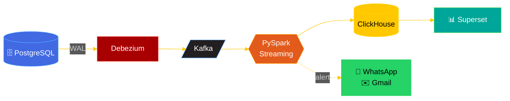
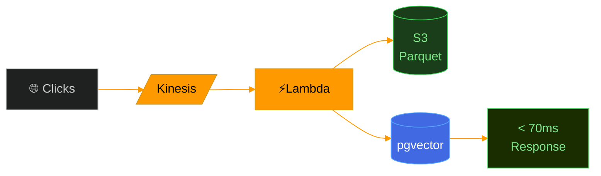
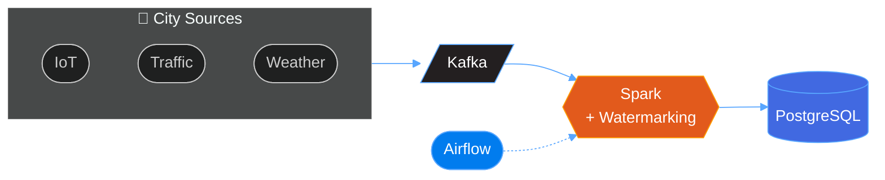
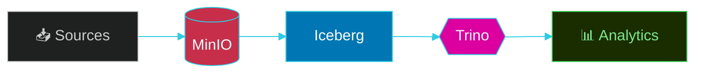

<!-- ╔══════════════════════════════════════════════════════════════════╗
     ║  SHEHAB ELDIN AHMED — Data Engineer Profile README              ║
     ║  Design: Midnight Gradient · Cyan Accent · Recruiter-First      ║
     ╚══════════════════════════════════════════════════════════════════╝ -->


<!-- ═══════════ IDENTITY BLOCK ═══════════ -->

<div align="center">

<a href="https://github.com/shehab-hub-0">
  
</a>

<br/>

# Shehab Eldin Ahmed

**`Data Engineer · Cloud Pipeline Architect · Big Data Developer`**


<br/>


<br/>

[](https://www.linkedin.com/in/shehab-eldinahmed/)
[](mailto:shahbahmed56p@gmail.com)
[](https://shehab-hub-0.github.io/Shehab.github1.io/)
[](https://www.youtube.com/@SchemaBilArabi)
[](https://github.com/shehab-hub-0)

<br/>

&nbsp;


</div>

<br/>

---

<!-- ═══════════ QUICK FACTS ═══════════ -->

<div align="center">

| 🏗️ **5+ Production Pipelines** | ☁️ **AWS · Azure · GCP** | 🏅 **7 Verified Certifications** | 🎙️ **YouTube Educator** |
|:---:|:---:|:---:|:---:|
| CDC · Streaming · Lakehouse | Multi-Cloud Architectures | IBM · Google · DataCamp · MSFT | [Schema بالعربي](https://www.youtube.com/@SchemaBilArabi) |

</div>

<br/>

---

<!-- ═══════════ §1 WHO I AM ═══════════ -->

<h2>
  
  &nbsp;Who I Am
</h2>

<table>
<tr>
<td width="52%" valign="top">

```yaml
name       : Shehab Eldin Ahmed Moawed
location   : Beni Suef, Egypt 🇪🇬
phone      : +20 101 145 7319
languages  : [Arabic (Native), English (Professional)]

education:
  - B.Tech · Industrial Control & Electronics
    Beni-Suef University — Expected Aug 2027
  - B.S. · Computer Science
    University of the People — 2026–Present

currently:
  - AWS ML Engineer Trainee @ DEPI
  - Data Science Intern @ AXIS AI Initiative

open_to:
  - Junior / Mid Data Engineering Roles
  - Graduate Programs & Research
  - Open-Source Collaboration
```

</td>
<td width="48%" valign="top">

### 🧭 &nbsp;What I Do

I design and operate **end-to-end data pipelines** — from raw event ingestion to clean analytical assets — across cloud and open-source stacks.

My work spans **real-time CDC and streaming** (Kafka, Spark Streaming, Debezium), **Medallion Lakehouse architectures** (Delta Lake, Iceberg), and **cloud-native orchestration** (Airflow, dbt) on AWS, Azure, and GCP.

### 💬 &nbsp;Philosophy

> *"Good data engineering is invisible. The pipeline runs, the data is accurate, and nobody has to think about it."*

### 🎙️ &nbsp;Content Creator

I run **[Schema بالعربي](https://www.youtube.com/@SchemaBilArabi)** — an Arabic YouTube channel breaking down Spark internals, Lakehouse patterns, and real-world DE project walkthroughs.

</td>
</tr>
</table>

<br/>

---

<!-- ═══════════ §2 TECH STACK ═══════════ -->

## 🛠️ &nbsp;Tech Stack

<div align="center">

| Domain | Technologies |
|:---|:---|
| **Data Engineering** |         |
| **Cloud** |         |
| **Storage & Warehouses** |        |
| **Languages & DBs** |        |
| **DevOps & IaC** |        |
| **Visualization** |     |

</div>

<br/>

---

<!-- ═══════════ §3 EXPERIENCE ═══════════ -->

## 📋 &nbsp;Experience

> 🟠 **AWS ML Engineer Trainee** — DEPI &nbsp;`Jul 2026 – Present`
>
> Completed AWS Academy tracks (Data Engineering, ML, NLP, GenAI). Built a Capstone integrating ML pipelines with cloud data architectures. Mastered Prompt Engineering for cloud-native GenAI workflows.

> 🔵 **Data Science Intern** — AXIS AI Initiative &nbsp;`May 2026 – Present`
>
> Built data preprocessing & feature engineering pipelines (Python, PySpark). Validated schemas and created dashboards to track model training metrics.

> 🟢 **Electrical & Automation Intern** — Rose Yarn Co. &nbsp;`Mar – May 2026`
>
> Monitored PLC control systems, automation sensors, and manufacturing telemetry. Maintained electrical distribution panels.

> 🔵 **Data Engineering Trainee** — DEPI (Microsoft Track) &nbsp;`Jul – Dec 2025`
>
> Designed streaming pipelines with Azure Event Hubs → Databricks → Delta Lake (Medallion). Orchestrated with Airflow & dbt into DuckDB. Built Snowflake models and Power BI dashboards. Tuned SQL & PySpark joins.

<br/>

---

<!-- ═══════════ §4 PROJECTS ═══════════ -->

## 🚀 &nbsp;Featured Projects

<!-- ── CDC PIPELINE ── -->
<details open>
<summary><b>🏦 Bank-Grade Real-Time CDC Pipeline</b> — <i>Fraud Detection & Financial Monitoring</i></summary>
<br/>

| | |
|:--|:--|
| **Problem** | Detect "Whale" transactions (≥ 55K EGP) and anomalies in real-time without overloading production databases. |
| **Architecture** | `PostgreSQL` → `Debezium CDC` → `Kafka` → `PySpark Streaming` → `ClickHouse OLAP` → `Superset` |
| **Results** | ⚡ Sub-second latency &nbsp;·&nbsp; 🛡️ 23-column schema validation &nbsp;·&nbsp; 📲 WhatsApp/Gmail alerts &nbsp;·&nbsp; 📊 15 live charts |


```mermaid
%%{init:{"theme":"dark","themeVariables":{"lineColor":"#FFC800","primaryTextColor":"#c9d1d9"}}}%%
flowchart LR
    A[("🗄️ PostgreSQL")] -->|WAL| B["Debezium"]
    B --> C[/"Kafka"/]
    C --> D{{"PySpark\nStreaming"}}
    D --> E[("ClickHouse")]
    D -.->|alert| F["📱 WhatsApp\n✉️ Gmail"]
    E --> G["📊 Superset"]

    style A fill:#4169E1,stroke:#58a6ff,color:#fff
    style B fill:#A80000,stroke:#ff7b72,color:#fff
    style C fill:#231F20,stroke:#58a6ff,color:#fff
    style D fill:#E25A1C,stroke:#ff9900,color:#fff
    style E fill:#FFC800,stroke:#ffd700,color:#000
    style F fill:#25D366,stroke:#25D366,color:#000
    style G fill:#00A699,stroke:#39d353,color:#fff
```

      

[](https://github.com/shehab-hub-0/CDC)

</details>

---

<!-- ── CAREVISION ── -->
<details>
<summary><b>🏥 CareVision — Real-Time Patient Flow Analytics</b> — <i>Azure · Medallion · Delta Lake</i></summary>
<br/>

| | |
|:--|:--|
| **Problem** | Hospital ER teams relied on stale data for triage and bed allocation decisions. |
| **Architecture** | `Azure Event Hub` → `Databricks PySpark` → `Delta Lake (Bronze/Silver/Gold)` → `Synapse` → `Power BI` |
| **Results** | ⚡ < 0.8s processing latency &nbsp;·&nbsp; 📈 25% triage throughput improvement &nbsp;·&nbsp; 🛡️ ACID-compliant reads |


```mermaid
%%{init:{"theme":"dark","themeVariables":{"lineColor":"#00d4ff"}}}%%
flowchart LR
    A["🏥 Hospital"] --> B[/"Event Hub"/]
    B --> C{{"Databricks\nPySpark"}}
    C --> D["🥉Bronze"] --> E["🥈Silver"] --> F["🥇Gold"]
    F --> G[("Synapse")] --> H["📊 Power BI"]

    style B fill:#0078D4,stroke:#58a6ff,color:#fff
    style C fill:#FF3621,stroke:#ff7b72,color:#fff
    style D fill:#3d2400,stroke:#d29922,color:#e3b341
    style E fill:#0d2137,stroke:#58a6ff,color:#79c0ff
    style F fill:#1a2d00,stroke:#39d353,color:#7ee787
    style G fill:#0089D6,stroke:#58a6ff,color:#fff
    style H fill:#F2C811,stroke:#ffd700,color:#000
```

    

[](https://github.com/shehab-hub-0/Real-time_Patient_Flow_Analytics_Healthcare)

</details>

---

<!-- ── AWS RECOMMENDATION ── -->
<details>
<summary><b>⚡ Real-Time Recommendation Engine</b> — <i>AWS · Kinesis · pgvector</i></summary>
<br/>

| | |
|:--|:--|
| **Problem** | E-commerce platform needed personalized recommendations in < 100ms from live clickstreams. |
| **Architecture** | `AWS Kinesis` → `Lambda` → `S3 (Parquet)` + `Glue Catalog` + `RDS pgvector` → API |
| **Results** | ⚡ < 70ms response &nbsp;·&nbsp; 🚀 10K req/s peak &nbsp;·&nbsp; 📉 45% storage reduction (Snappy) |


```mermaid
%%{init:{"theme":"dark","themeVariables":{"lineColor":"#FF9900"}}}%%
flowchart LR
    A["🌐 Clicks"] --> B[/"Kinesis"/]
    B --> C["⚡Lambda"]
    C --> D[("S3\nParquet")]
    C --> E[("pgvector")]
    E --> F["< 70ms\nResponse"]

    style B fill:#FF9900,stroke:#d29922,color:#000
    style C fill:#FF9900,stroke:#d29922,color:#000
    style D fill:#1a3d1a,stroke:#39d353,color:#7ee787
    style E fill:#4169E1,stroke:#58a6ff,color:#fff
    style F fill:#1a2d00,stroke:#39d353,color:#7ee787
```

    

[](https://github.com/shehab-hub-0/aws-batch-streaming-pipeline)

</details>

---

<!-- ── SMART CITY ── -->
<details>
<summary><b>🏙️ Smart City IoT Platform</b> — <i>Kafka · Spark Watermarking · Airflow</i></summary>
<br/>

| | |
|:--|:--|
| **Problem** | Chaotic IoT feeds from traffic cameras, weather sensors, and emergency reports needed unified processing. |
| **Architecture** | `Kafka Topics` → `PySpark Streaming (Watermarking)` → `PostgreSQL` · Orchestrated by `Airflow` |
| **Results** | 🌊 15-min late data handling &nbsp;·&nbsp; ⏱️ 100% ETL automation (5-min cycles) &nbsp;·&nbsp; ⚡ 40% faster queries |


```mermaid
%%{init:{"theme":"dark","themeVariables":{"lineColor":"#58a6ff"}}}%%
flowchart LR
    subgraph src["📡 City Sources"]
        A(["IoT"]) & B(["Traffic"]) & C(["Weather"])
    end
    D[/"Kafka"/] --> E{{"Spark\n+ Watermarking"}} --> F[("PostgreSQL")]
    src --> D
    G(["Airflow"])-.->E

    style D fill:#231F20,stroke:#58a6ff,color:#fff
    style E fill:#E25A1C,stroke:#ff9900,color:#fff
    style F fill:#4169E1,stroke:#58a6ff,color:#fff
    style G fill:#017CEE,stroke:#58a6ff,color:#fff
```

    

[](https://github.com/shehab-hub-0/Smart_City_Data_Engineering_Project)

</details>

---

<!-- ── LAKEHOUSE ── -->
<details>
<summary><b>🗄️ Modern Data Lakehouse</b> — <i>Iceberg · Trino · MinIO · Airflow</i></summary>
<br/>

| | |
|:--|:--|
| **Problem** | Proprietary data warehouses were too costly; needed open-source ACID-compliant alternative with time-travel. |
| **Architecture** | `MinIO (S3)` → `Apache Iceberg` → `Trino` query engine · Orchestrated by `Airflow` |
| **Results** | 💰 40% cost reduction &nbsp;·&nbsp; ⚡ 35% faster queries vs Hive &nbsp;·&nbsp; 🕒 Schema evolution + time-travel |


```mermaid
%%{init:{"theme":"dark","themeVariables":{"lineColor":"#2DCDE4"}}}%%
flowchart LR
    A["📥 Sources"] --> B[("MinIO")]
    B --> C["Iceberg"]
    C --> D{{"Trino"}}
    D --> E["📊 Analytics"]

    style B fill:#C72E49,stroke:#2DCDE4,color:#fff
    style C fill:#0077B5,stroke:#2DCDE4,color:#fff
    style D fill:#DD00A1,stroke:#2DCDE4,color:#fff
    style E fill:#1a2d00,stroke:#39d353,color:#7ee787
```

    

[](https://github.com/shehab-hub-0/Modern_Data_Lakehouse)

</details>

<br/>

---

<!-- ═══════════ §5 GITHUB STATS ═══════════ -->

## 📊 &nbsp;GitHub Activity

<div align="center">


&nbsp;&nbsp;


<br/><br/>


<br/><br/>


<br/><br/>


</div>

<br/>

---

<!-- ═══════════ §6 CERTIFICATIONS ═══════════ -->

## 🏅 &nbsp;Certifications

| Badge | Certification | Issuer | Date | Verify |
|:---:|:---|:---|:---:|:---:|
|  | **Google Data Analytics Specialization** | Coursera / Google | May 2026 | [🔗](https://www.coursera.org/account/accomplishments/specialization/XZOFPXP3AIS5) |
|  | **IBM Data Warehouse Engineer** | Coursera / IBM | Apr 2026 | [🔗](https://www.coursera.org/account/accomplishments/professional-cert/5PWY6EI5OTPQ) |
|  | **IBM Data Engineering Professional** | Coursera / IBM | Feb 2026 | [🔗](https://www.coursera.org/account/accomplishments/professional-cert/D0HKIMS8AKO4) |
|  | **Data Engineer Career Track** | DataCamp | Mar 2026 | [🔗](https://www.datacamp.com/certificate/DE0019416075200) |
|  | **Cloud & AI on GCP** | Google Developers & ITI | May 2026 | [🔗](https://drive.google.com/file/d/1bJfIzBoi6maS6R7qoOvZEQP9WgyRlVWv/view?usp=sharing) |
|  | **Microsoft Data Engineer Program** | DEPI | Dec 2025 | [🔗](https://drive.google.com/file/d/1B3OGEbotKJgFNuBabv_9X128z5Znjqra/view?usp=sharing) |
|  | **Apache Airflow 3 Fundamentals** | Astronomer / Credly | Oct 2025 | [🔗](https://www.credly.com/badges/a5cb199f-7f4d-4035-88f0-fbc003e5638a) |

<br/>

---

<!-- ═══════════ §7 YOUTUBE ═══════════ -->

## 📺 &nbsp;Latest from Schema بالعربي

<div align="center">

[](https://www.youtube.com/@SchemaBilArabi)

</div>

| | Tutorial | Topic |
|:---:|:---|:---|
| ▶️ | [**Microsoft Fabric Full Project**](https://youtu.be/an2cWuJbi98) | End-to-End Sales Data Engineering & Analytics |
| ▶️ | [**Modern Data Lakehouse Architecture**](https://youtu.be/mk15S0zEEyQ) | Apache Spark · MinIO · Nessie · Dremio · ClickHouse |
| ▶️ | [**WSL & Docker for Data Engineering**](https://youtu.be/Ne7DCyxus8s?si=CBQ5XH2eCi9iPBsB) | Setting Up a Production-Grade Local Dev Environment |

<br/>

---

<!-- ═══════════ §8 ROADMAP ═══════════ -->

## 🗺️ &nbsp;Learning Roadmap

<table>
<tr>
<td width="33%" valign="top">

### ✅ &nbsp;Done

```
Python (Advanced · OOP · Async)
SQL (CTEs · Window Funcs · Tuning)
Apache Spark & PySpark Streaming
Apache Kafka & Debezium CDC
Apache Airflow DAGs
dbt & DuckDB Transformation
Delta Lake & Apache Iceberg
ClickHouse OLAP
Medallion Architecture
Azure Databricks · Synapse
AWS Glue · Kinesis · Lambda
Docker · Terraform · Linux
Superset & Power BI
```

</td>
<td width="33%" valign="top">

### 🔄 &nbsp;In Progress

```
Databricks Spark Certification
 ├─ Delta Live Tables
 ├─ Unity Catalog
 └─ MLflow

AWS Machine Learning & GenAI
 ├─ Prompt Engineering
 ├─ Bedrock & SageMaker
 └─ RAG Architecture

Microsoft Fabric
 ├─ OneLake / DirectLake
 └─ Real-Time Analytics

Advanced Streaming
 ├─ Exactly-Once Semantics
 └─ Stateful Processing
```

</td>
<td width="33%" valign="top">

### 🚀 &nbsp;Next

```
Azure DP-203 Certification
Databricks Certified Professional

Apache Flink
 ├─ Stateful Processing
 └─ Complex Event Processing

MLOps Integration
 ├─ Feature Stores (Feast)
 └─ Pipeline Drift Detection

Open-Source Contributions
 ├─ Airflow Core & Providers
 └─ dbt Community Packages
```

</td>
</tr>
</table>

<br/>

---

<!-- ═══════════ §9 CONTACT ═══════════ -->

<div align="center">


<br/><br/>

[](https://www.linkedin.com/in/shehab-eldinahmed/)&nbsp;
[](mailto:shahbahmed56p@gmail.com)&nbsp;
[](https://shehab-hub-0.github.io/Shehab.github1.io/)&nbsp;
[](https://www.youtube.com/@SchemaBilArabi)

<br/>

📍 Beni Suef, Egypt · Open to Remote & Relocation · 📞 +20 101 145 7319

</div>

<br/>


<div align="center">
<sub>
   &nbsp;
  
</sub>
</div>
