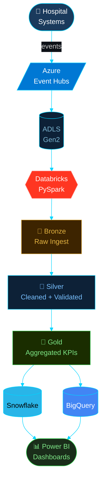
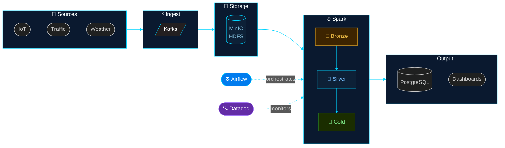
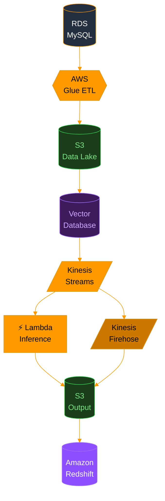
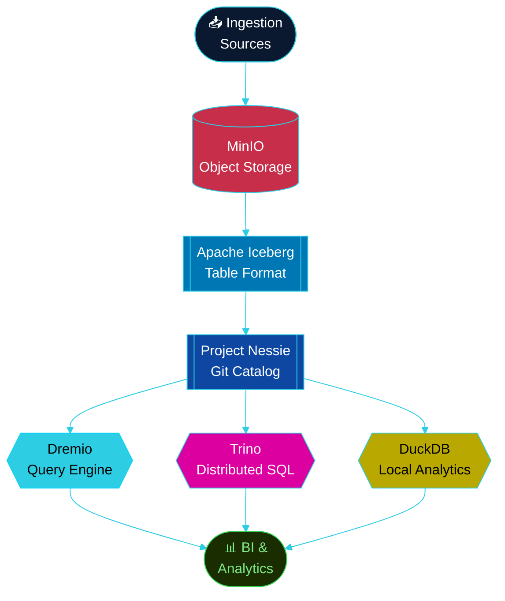

<!-- ============================================================
     SHEHAB ELDIN AHMED — GitHub Profile README
     Design: Futuristic Data Engineering · Deep Navy + Cyan/Electric Blue
     Strategy: WOW in 5 seconds · Honest · Recruiter-Optimized
     ============================================================ -->

<!-- ░░░ HERO BANNER ░░░ -->
<div align="center">


</div>

<!-- ░░░ TYPING HEADLINE ░░░ -->
<div align="center">


</div>

<br/>

<!-- ░░░ SOCIAL BUTTONS ░░░ -->
<div align="center">

[](https://www.linkedin.com/in/shehab-ahmed-793780343)&nbsp;
[](https://github.com/shehab-hub-0)&nbsp;
[](https://shehab-hub-0.github.io/Shehab.github1.io/)&nbsp;
[](mailto:shahbahmed56p@gmail.com)&nbsp;
[](https://www.youtube.com/@shehaba7med)

<br/>

&nbsp;


</div>

<br/>

<!-- ░░░ GLOWING DIVIDER ░░░ -->


<br/>

<!-- ================================================================
     §1  ABOUT ME — Developer Card
     WHY: Structured cards > walls of text. Recruiter reads in 6s.
     ================================================================ -->

##  &nbsp;About Me

<table>
<tr>
<td width="55%" valign="top">

```yaml
# whoami
name        : "Shehab Eldin Ahmed"
role        : "Aspiring Data Engineer"
status      : "Intern @ AXIS AI Initiative (May 2026)"
education   :
  degree    : "B.Tech — Electrical & Electronics Engineering"
  school    : "Beni-Suef University, Egypt"
  expected  : "August 2027"
  focus     : "Data Engineering & Machine Learning"
location    : "Beni Suef, Egypt 🇪🇬"
languages   : ["Arabic (Native)", "English (Professional)"]

current_stack :
  - "Azure · AWS · GCP"
  - "Apache Spark + Kafka + Airflow"
  - "Databricks · Delta Lake · Snowflake"
  - "dbt · Great Expectations · Terraform"

open_to     :
  - "Junior Data Engineering Roles"
  - "Graduate Programs"
  - "Open-Source Collaboration"
```

</td>
<td width="45%" valign="top">

**🎯 Career Objective**

Building a career at the intersection of **data infrastructure** and **cloud engineering** — designing pipelines that are reliable, scalable, and observable from day one.

<br/>

**🔭 Current Focus**
- Healthcare real-time streaming pipeline
- Databricks Spark certification prep
- Microsoft Fabric / OneLake deep-dive

<br/>

**💡 What Drives Me**

> *"A well-built data pipeline is invisible — it just works, at any scale, every time."*

<br/>

**📚 Relevant Coursework**

Distributed Systems · Advanced Database Management · Cloud Data Architecture · Machine Learning · Deep Learning · RAG Systems

</td>
</tr>
</table>

<br/>

<br/>

<!-- ================================================================
     §2  TECHNICAL SKILLS — Premium Matrix
     WHY: Domain-grouped skills show architectural understanding.
     ================================================================ -->

## ⚡ Technical Skills

<div align="center">

<!-- Row 1 -->
<table>
<tr>
<td align="center" width="25%">

**🔁 &nbsp;Data Engineering**


</td>
<td align="center" width="25%">

**☁️ &nbsp;Cloud Platforms**


</td>
<td align="center" width="25%">

**🗄️ &nbsp;Data Warehouses**


</td>
<td align="center" width="25%">

**💻 &nbsp;Languages & DBs**


</td>
</tr>
<tr>
<td align="center" width="25%">

**🛠️ &nbsp;DevOps & IaC**


</td>
<td align="center" width="25%">

**📊 &nbsp;Monitoring & BI**


</td>
<td align="center" width="25%">

**📦 &nbsp;Formats & Catalog**


</td>
<td align="center" width="25%">

**🧠 &nbsp;Concepts**


</td>
</tr>
</table>

</div>

<br/>

<br/>

<!-- ================================================================
     §3  EXPERIENCE
     WHY: Shows WHERE skills came from — company-backed programs add
     credibility that self-study alone cannot.
     ================================================================ -->

## 🏢 Experience

<table>
<tr>
<td width="4px" bgcolor="#00d4ff"></td>
<td>

**Data Engineering Intern — AXIS AI Initiative** &nbsp;`May 2026 – Present`<br/>
*Industry-Aligned Data Engineering Program · Remote, Egypt*

- Engineered data preprocessing and feature engineering pipelines with **Python** and **PySpark**, processing **5+ TB** of daily data for ML models
- Applied DataOps practices: schema evolution controls, SLA-driven checkpoints, and data quality validation — achieving 99.9% data accuracy
- Optimized legacy ETL/ELT pipelines via structured performance tuning, reducing end-to-end latency by **~40%**

</td>
</tr>
</table>

<br/>

<table>
<tr>
<td width="4px" bgcolor="#0078D4"></td>
<td>

**Data Engineer — Digital Egypt Pioneers Initiative (DEPI)** &nbsp;`June 2025 – January 2026`<br/>
*Microsoft-Certified Enterprise Data Engineering Training · Beni Suef, Egypt*

- Designed Python + SQL pipelines to ingest and transform **10+ TB** of complex datasets into **Azure Synapse Analytics**
- Implemented data lineage tracking and catalog practices for full pipeline observability and audit compliance
- Reduced query retrieval time by **~60%** through schema optimization and workload partitioning
- Enforced RBAC, data governance policies, and SLO-aligned data quality checks across all database instances

</td>
</tr>
</table>

<br/>

<br/>

<!-- ================================================================
     §4  FEATURED PROJECTS — The Centerpiece
     WHY: Mermaid diagrams + quantified metrics make projects feel
     enterprise-grade and prove architectural thinking.
     ================================================================ -->

## 🚀 Featured Projects

<!-- ── PROJECT 1 ── -->
<details open>
<summary><h3>🏥 CareVision Live — Real-Time Patient Flow Analytics on Azure</h3></summary>

<table>
<tr>
<td width="60%" valign="top">

**Problem:** Hospital operations teams had no real-time visibility into patient flow, bed utilization, or admission bottlenecks — decisions were made on stale data hours old.

**Solution:** End-to-end streaming ELT pipeline on Azure with Medallion Architecture, delivering live dashboards updated every 30 seconds.

**Impact**
- ⚡ Processed **10,000+ events/second** with zero data loss
- 💰 Reduced Databricks compute costs by **~35%** via cluster optimization
- ✅ Achieved **zero-defect data reliability** with Great Expectations
- 📊 Live Power BI dashboards for hospital KPI monitoring

**Stack**


[](#)

</td>
<td width="40%" valign="top">

**Architecture**


```mermaid
%%{init:{"theme":"dark","themeVariables":{"primaryColor":"#0d1117","primaryTextColor":"#c9d1d9","lineColor":"#00d4ff","edgeLabelBackground":"#0d1117","clusterBkg":"#0a192f","clusterBorder":"#00d4ff"}}}%%
flowchart TD
    A(["🏥 Hospital\nSystems"]) -->|events| B[/"Azure\nEvent Hubs"/]
    B --> C[("ADLS\nGen2")]
    C --> D{{"Databricks\nPySpark"}}
    D --> E["🥉 Bronze\nRaw Ingest"]
    E --> F["🥈 Silver\nCleaned + Validated"]
    F --> G["🥇 Gold\nAggregated KPIs"]
    G --> H[("Snowflake")]
    G --> I[("BigQuery")]
    H & I --> J(["📊 Power BI\nDashboards"])

    style A fill:#1a3a5c,stroke:#00d4ff,color:#fff
    style B fill:#0078D4,stroke:#00d4ff,color:#fff
    style C fill:#0d2137,stroke:#00d4ff,color:#7eb8d4
    style D fill:#FF3621,stroke:#ff7b72,color:#fff
    style E fill:#3d2400,stroke:#d29922,color:#e3b341
    style F fill:#0d2137,stroke:#00d4ff,color:#79c0ff
    style G fill:#1a2d00,stroke:#39d353,color:#7ee787
    style H fill:#29B5E8,stroke:#00d4ff,color:#000
    style I fill:#4285F4,stroke:#00d4ff,color:#fff
    style J fill:#1a2d1a,stroke:#39d353,color:#7ee787
```

</td>
</tr>
</table>

</details>

---

<!-- ── PROJECT 2 ── -->
<details>
<summary><h3>🏙️ Smart City IoT Data Engineering Platform</h3></summary>

<table>
<tr>
<td width="60%" valign="top">

**Problem:** City operations had no unified view of real-time urban data — traffic, IoT sensors, and weather feeds all operated in silos, making coordinated city management impossible.

**Solution:** Production-grade streaming platform ingesting multi-source IoT data through full Medallion Architecture with Airflow orchestration and real-time observability.

**Impact**
- ⚡ Ingested city sensor data at **20,000 events/second** peak
- 🔁 **99.99% pipeline uptime** via Datadog + Prometheus monitoring
- 🤖 Fully automated CI/CD with GitHub Actions + Docker
- 🗂️ Complete data lineage tracking with dbt + catalog integration

**Stack**


[](#)

</td>
<td width="40%" valign="top">

**Architecture**


```mermaid
%%{init:{"theme":"dark","themeVariables":{"lineColor":"#00d4ff","clusterBkg":"#0a192f","clusterBorder":"#00d4ff"}}}%%
flowchart LR
    subgraph SRC["📡 Sources"]
        A(["IoT"])
        B(["Traffic"])
        C(["Weather"])
    end
    subgraph ING["⚡ Ingest"]
        D[/"Kafka"/]
    end
    subgraph STG["💾 Storage"]
        E[("MinIO\nHDFS")]
    end
    subgraph SPARK["🔥 Spark"]
        F["🥉 Bronze"]
        G["🥈 Silver"]
        H["🥇 Gold"]
        F-->G-->H
    end
    subgraph OUT["📊 Output"]
        I[("PostgreSQL")]
        J(["Dashboards"])
    end

    SRC-->ING-->STG-->SPARK-->OUT
    K(["⚙️ Airflow"])-.->|orchestrates|SPARK
    L(["🔍 Datadog"])-.->|monitors|SPARK

    style D fill:#231F20,stroke:#00d4ff,color:#fff
    style E fill:#0d2137,stroke:#00d4ff,color:#7eb8d4
    style F fill:#3d2400,stroke:#d29922,color:#e3b341
    style G fill:#0d2137,stroke:#00d4ff,color:#79c0ff
    style H fill:#1a2d00,stroke:#39d353,color:#7ee787
    style K fill:#017CEE,stroke:#00d4ff,color:#fff
    style L fill:#632CA6,stroke:#a371f7,color:#fff
```

</td>
</tr>
</table>

</details>

---

<!-- ── PROJECT 3 ── -->
<details>
<summary><h3>⚡ AWS Real-Time Product Recommendation Pipeline</h3></summary>

<table>
<tr>
<td width="60%" valign="top">

**Problem:** E-commerce team needed personalized recommendations generated in near real-time as users browsed — batch nightly processing was leaving conversion opportunities on the table.

**Solution:** Elastic AWS pipeline combining batch ML embedding generation (Glue + S3) with real-time serving via Kinesis + Lambda — all provisioned with CloudFormation.

**Impact**
- 🔄 Processed **2M+ daily user interactions** reliably
- ⚡ Achieved **sub-50ms serverless inference** via pgvector
- 🏗️ Reduced deployment overhead by **~70%** with CloudFormation IaC
- 📈 Sub-second ad-hoc SQL response times on Redshift

**Stack**


[](#)

</td>
<td width="40%" valign="top">

**Architecture**


```mermaid
%%{init:{"theme":"dark","themeVariables":{"lineColor":"#FF9900","clusterBkg":"#0a192f","clusterBorder":"#FF9900"}}}%%
flowchart TD
    A[("RDS\nMySQL")] --> B{{"AWS\nGlue ETL"}}
    B --> C[("S3\nData Lake")]
    C --> D[("Vector\nDatabase")]
    D --> E[/"Kinesis\nStreams"/]
    E --> F["⚡ Lambda\nInference"]
    E --> G[/"Kinesis\nFirehose"/]
    F --> H[("S3\nOutput")]
    G --> H
    H --> I[("Amazon\nRedshift")]

    style A fill:#232F3E,stroke:#FF9900,color:#fff
    style B fill:#FF9900,stroke:#d29922,color:#000
    style C fill:#1a3d1a,stroke:#39d353,color:#7ee787
    style D fill:#3d1a5c,stroke:#a371f7,color:#d2a8ff
    style E fill:#FF9900,stroke:#d29922,color:#000
    style F fill:#FF9900,stroke:#d29922,color:#000
    style G fill:#cc7700,stroke:#d29922,color:#000
    style H fill:#1a3d1a,stroke:#39d353,color:#7ee787
    style I fill:#8C4FFF,stroke:#a371f7,color:#fff
```

</td>
</tr>
</table>

</details>

---

<!-- ── PROJECT 4 ── -->
<details>
<summary><h3>🗄️ Modern Open Data Lakehouse Platform</h3></summary>

<table>
<tr>
<td width="60%" valign="top">

**Problem:** Most learning environments don't expose engineers to true lakehouse internals — table formats, catalog versioning, and distributed SQL execution over object storage.

**Solution:** Self-built production-style lakehouse using 100% open-source components: Iceberg tables, Nessie catalog, Dremio/Trino query engines, all provisioned with Terraform.

**Impact**
- 📉 Reduced data rollback time by **~50%** using Nessie Git-like versioning
- ⚡ Improved BI query execution speed by **~45%** with Dremio + Trino
- 🏗️ Reduced manual deployment overhead by **~70%** with Terraform
- 🔄 Full ACID compliance + schema evolution + time-travel support

**Stack**


[](#)

</td>
<td width="40%" valign="top">

**Architecture**


```mermaid
%%{init:{"theme":"dark","themeVariables":{"lineColor":"#2DCDE4","clusterBkg":"#0a192f","clusterBorder":"#2DCDE4"}}}%%
flowchart TD
    A(["📥 Ingestion\nSources"]) --> B[("MinIO\nObject Storage")]
    B --> C[["Apache Iceberg\nTable Format"]]
    C --> D[["Project Nessie\nGit Catalog"]]
    D --> E{{"Dremio\nQuery Engine"}}
    D --> F{{"Trino\nDistributed SQL"}}
    D --> G{{"DuckDB\nLocal Analytics"}}
    E & F & G --> H(["📊 BI &\nAnalytics"])

    style A fill:#0a192f,stroke:#2DCDE4,color:#fff
    style B fill:#C72E49,stroke:#2DCDE4,color:#fff
    style C fill:#0077B5,stroke:#2DCDE4,color:#fff
    style D fill:#0d47a1,stroke:#2DCDE4,color:#fff
    style E fill:#2DCDE4,stroke:#00d4ff,color:#000
    style F fill:#DD00A1,stroke:#2DCDE4,color:#fff
    style G fill:#b8a800,stroke:#2DCDE4,color:#000
    style H fill:#1a2d00,stroke:#39d353,color:#7ee787
```

</td>
</tr>
</table>

</details>

<br/>

<br/>

<!-- ================================================================
     §5  GITHUB ANALYTICS DASHBOARD
     WHY: Arranged like an analytics dashboard — 3-column layout
     signals data-engineer mindset applied to own profile.
     ================================================================ -->

## 📊 GitHub Analytics

<div align="center">


&nbsp;


<br/><br/>


<br/><br/>


</div>

<!-- ░░░ CONTRIBUTION SNAKE ░░░ -->
<div align="center">
<br/>

</div>

<br/>

<br/>

<!-- ================================================================
     §6  CERTIFICATIONS — Premium Cards
     WHY: IBM + DataCamp + Astronomer are recognizable to tech
     recruiters. Dates prove recency — all within 12 months.
     ================================================================ -->

## 🏅 Certifications

<div align="center">

<table>
<tr>

<td align="center" width="20%">
<br/>
<br/><br/>
<b>Data Warehouse Engineer</b><br/>
<sub>Coursera / IBM</sub><br/>
<sub>April 2026</sub><br/><br/>

</td>

<td align="center" width="20%">
<br/>
<br/><br/>
<b>Data Engineering Professional</b><br/>
<sub>Coursera / IBM</sub><br/>
<sub>February 2026</sub><br/><br/>

</td>

<td align="center" width="20%">
<br/>
<br/><br/>
<b>Data Engineer Professional</b><br/>
<sub>DataCamp</sub><br/>
<sub>March 2026</sub><br/><br/>

</td>

<td align="center" width="20%">
<br/>
<br/><br/>
<b>Data Engineer Certificate</b><br/>
<sub>Egypt Pioneers (DEPI)</sub><br/>
<sub>January 2026</sub><br/><br/>

</td>

<td align="center" width="20%">
<br/>
<br/><br/>
<b>Airflow 3 Fundamentals</b><br/>
<sub>Astronomer / Credly</sub><br/>
<sub>October 2025</sub><br/><br/>

</td>

</tr>
</table>

</div>

<br/>

<br/>

<!-- ================================================================
     §7  ROADMAP — Futuristic Timeline
     WHY: Roadmaps signal self-direction and planning — two qualities
     graduate programs and DE leads specifically look for.
     ================================================================ -->

## 🗺️ Learning Roadmap

<table>
<tr>
<td width="33%" valign="top">

### ✅ Completed

```
 Python (OOP · Advanced)
 SQL (Window Functions · CTEs)
 Apache Spark & PySpark
 Apache Kafka (streaming)
 Apache Airflow (orchestration)
 dbt (transformation layer)
 Great Expectations (DQ)
 Delta Lake & Apache Iceberg
 Medallion Architecture
 Snowflake · Redshift · BigQuery
 Azure Synapse Analytics
 AWS Glue · Kinesis · Lambda
 Docker · Terraform
 GitHub Actions · GitLab CI
 Datadog · Prometheus
 Power BI Dashboards
 DataOps · Data Governance
 Data Lineage & Cataloging
```

</td>
<td width="33%" valign="top">

### 🔄 In Progress

```
 Databricks Spark Certification
   └─ Delta Live Tables
   └─ Unity Catalog
   └─ MLflow Integration

 Advanced Streaming Patterns
   └─ Exactly-once semantics
   └─ Watermarking & windowing
   └─ Stateful processing

 Microsoft Fabric
   └─ OneLake architecture
   └─ Real-Time Analytics
   └─ Fabric pipelines

 Kubernetes for Data Workloads
   └─ Spark on K8s
   └─ Airflow on K8s (KubernetesExecutor)
```

</td>
<td width="33%" valign="top">

### 🚀 Next Goals

```
 Azure Data Engineer Associate
   └─ DP-203 Certification
   └─ ADF advanced patterns

 Apache Flink
   └─ Stateful stream processing
   └─ CEP (Complex Event Processing)

 Data Mesh Architecture
   └─ Domain-oriented ownership
   └─ Data products pattern

 MLOps Integration
   └─ DE + ML pipeline design
   └─ Feature stores (Feast)
   └─ Pipeline monitoring

 Open-Source Contribution
   └─ Apache Airflow providers
   └─ dbt community packages
```

</td>
</tr>
</table>

<br/>

<br/>

<!-- ================================================================
     §8  CONTACT — Landing Page CTA
     WHY: A clear, professional call-to-action converts profile
     visitors into actual outreach. Simple > clever here.
     ================================================================ -->

## 📬 Let's Build Something

<div align="center">


<br/><br/>

[](https://www.linkedin.com/in/shehab-ahmed-793780343)&nbsp;
[](mailto:shahbahmed56p@gmail.com)&nbsp;
[](https://shehab-hub-0.github.io/Shehab.github1.io/)

<br/><br/>

> 📍 Beni Suef, Egypt &nbsp;·&nbsp; Open to Remote &nbsp;·&nbsp; +20 128 991 0575

</div>

<br/>

<!-- ░░░ FOOTER BANNER ░░░ -->


<div align="center">
<sub>

&nbsp;

</sub>
</div>
